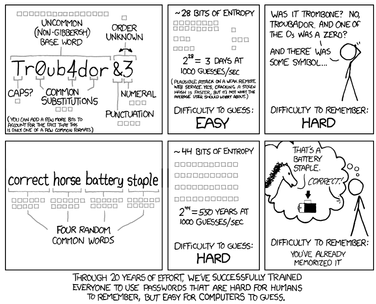
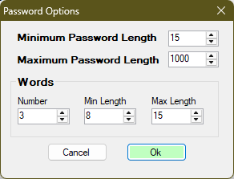
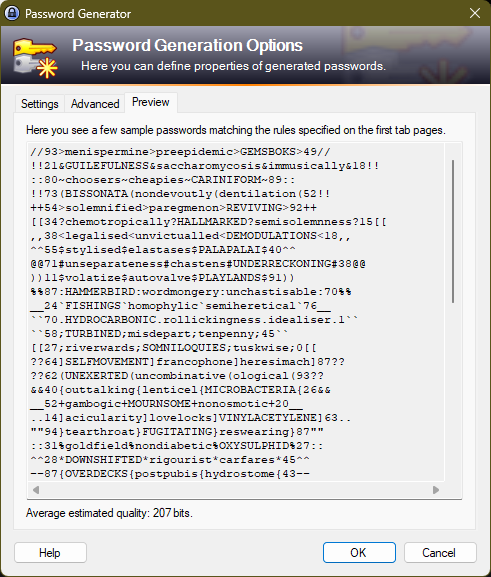
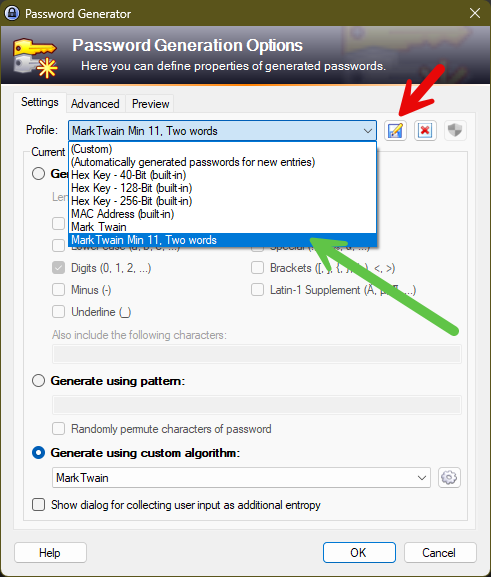
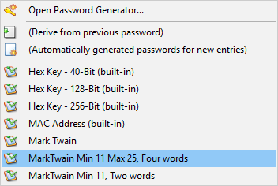

# MarkTwain
Plugin for KeePass that generates passwords as described by XKCD: https://xkcd.com/936/

## How to use this plugin

* Drop the MarkTwain.dll file (in the output folder) into the KeePass\Plugins folder.

* Open KeePass, and select Tools | Generate Password..

* In the Settings tab, select the Mark Twain profile from the Profile drop down menu.

* If you like, click the gear icon next to the custom algorithm setting to change the password generation options.
    * You can save these settings by selecting the save icon next to the Mark Twain profile, and creating a new profile. 
    * You can have as many profiles as you like - each with different settings.

* For KeePass entries, generate a Mark Twain password by selecting the key icon next to the password field, and select the Mark Twain profile, or any other saved profile.
## Options
Password options currently available:

Note that setting the Maximum Password Length too small may reduce your Words Min Length selection.

The minimum length password is 11. That consists of one 1-letter word and the necessary 10 characters to meet the XKCD style.

Password examples using those settings:

## Saving Profiles
Select the options you want, then save the profile

When you generate a password, use the profile saved previously

